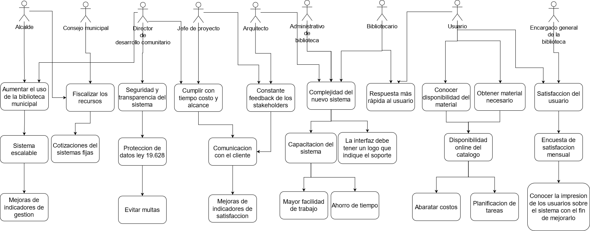

## **Contexto**

Se postulara a una licitación de la municipalidad de estación central, en la cual se requiere automatizar la mayoría de los procesos de la biblioteca de la comuna. La biblioteca posee un volumen de libros de 20.000 y se prevé un crecimiento del 10% anual, también se tienen materiales audiovisuales del orden de los 35.000 y se espera un crecimiento del 10% anual en estos. El publico que utiliza estos servicios asciende al 20% de la comuna(30.000 personas) y el objetivo es lograr abarcar el 30% de ella al año siguiente, para luego tener un crecimiento del 2% anual. Por lo cual el sistema debe ser robusto en capacidad y ser escalable a medida que la BEC aumenta de usuarios. Además se deberán crear usuarios con diferentes perfiles y autoridad dentro del sistema para los diferentes funcionarios de la biblioteca (11 personas) y funcionarios municipales que consultaras diferentes estados de esta misma.

Esta licitación esta mandatada por el alcalde Felipe Muñoz (FA) electo el año 2021, el cual le encarga la gestión a Marcelo Parra, Director de Desarrollo Comunitario, para presentar el proyecto al consejo municipal para su aprobación y posterior realización. Este consejo apoya la realización de este proyecto, por lo que no habría problemas para desarrollar este trabajo.

Por parte de la consultora se deberá Habilitar el software personalizado a esta biblioteca, por lo que la propiedad intelectual quedará para la municipalidad y con esto el costo aumentara. También debe estar operativo este sistema para el próximo ciclo de inicio de actividades educativas estudiantiles. Este proyecto estará a cargo del jefe de proyecto de la consultora, el cual será el puente de comunicación entre la municipalidad y el equipo de arquitecto de software que diseñaran las soluciones, para luego entregarlo a una empresa desarrolladora.

## **Objetivos**

Los objetivos del proyecto son:

1. Automatizar el sistema de registro y pedidos de la BEC; Dando así un servicio mas veloz eliminando los bien llamados choke points, para lograr atender a mas gente en menos tiempo, logrando abarcar a mayor cantidad de gente de la comuna.
2. El proyecto debe ser poder seguir funcionando teniendo en cuenta el volumen de datos que se tienen y soportando las tasa de crecimiento previstas.
3. Soportar una gran cantidad de solicitudes sin que se vaya el servicio, teniendo en cuenta la tasa de crecimiento.

## **Stakeholders**

<html>
<body>
<!--StartFragment-->

Stakeholders | Preocupaciones | Requerimientos | Valor aportado
-- | -- | -- | --
Alcalde, Municipio | Aumentar el uso de la biblioteca municipal. | El sistema debe contar con escalabilidad en la capacidad. |  A medida que la biblioteca aumenta su flujo de material y personas podrá seguir funcionando |   |   |  
Jefe de proyecto, Consultora | Mantener una buena imagen de la empresa. | Crear canales de comunicación de confianza con los clientes. |  Se podrá recibir feedback del cliente y asegurara que el proyecto avanza con seguridad. |   |   |  
Equipo de arquitectos, Consultora | Tener constante feedback de los stakeholders. | Utilizar metodologías agiles para trabajar. | El diseño del proyecto adaptarse en el camino que se trabaja con el cliente
Bibliotecario, Municipio | Lentitud del sistema | Los usuarios podrán realizar pedidos online y confirmarlos en el mesón. El tiempo de respuesta en las dependencias debe ser de 1s, estando remoto no debe superar los 3s. | El empleado no requerirá ir a las estanterías a revisar si queda material o no, ahorrando así tiempo
Administrativo bibliotecario, Municipio | Complejidad del nuevo sistema. | En el primer inicio de sesión del usuario debe desplegar un tutorial de como utilizar al app. La interfaz debe tener un logo  que indique el soporte. | Se facilitara la adaptación del usuario al sistema. en caso de error se podrá ayudar de forma rápida al usuario. |   |   |  
Director de desarrollo comunitario(DDC), Municipio | Seguridad y transparencia del sistema. | Los datos deben estar protegidos de acuerdo a la ley 19.628.  | Evitara multas.
Consejo Municipal, Municipio | Fiscalizar los recursos empleados. | Los datos deben ser auditables tal como dice la ley 21.131 | Mantendrá una buena imagen de la empresa
Encargado general biblioteca, Municipio | Satisfacción del usuario | 1 vez al mes se envié por correo una encuesta de satisfacción | Medirá la conformidad de los usuarios. |   |   |  
Estudiantes, Vecinos, Municipio | Disponibilidad del material. | El stock de la biblioteca debe estar disponible online, no así el componente de pedidos. El sistema será capaz de seguir funcionando sin conectividad a Internet. En caso de suministro eléctrico se podrá realizar prestamos de forma manual | Reducirá los costes, mientras que a su vez permite a los usuarios planificar sus estudios.

<!--EndFragment-->
</body>
</html>

## **Requisitos funcionales**

1. Se debe poder ver la disponibilidad del material en el sistema.
2. 1 vez al mes se envié por correo una encuesta de satisfacción
3. El sistema será capaz de seguir funcionando sin conectividad a Internet, solo en las dependencias de la biblioteca
4. Los usuarios podrán realizar pedidos online y confirmarlos en el mesón.
5. En el primer inicio de sesión del usuario debe desplegar un tutorial de como utilizar al app.
6. La interfaz debe tener un logo  que indique el soporte.
7. El stock de la biblioteca debe estar disponible online, no así el componente de pedidos.
8. En caso de corte del suministro eléctrico se podrá realizar prestamos de forma manual, como se hacia antes de la implementación del sistema.

## **Requisitos no funcionales**

1. El tiempo de respuesta en las dependencias debe ser de 1s, estando remoto no debe superar los 3s.
2. Utilizar metodologías agiles para trabajar.
3. Los datos deben estar protegidos de acuerdo a la ley 19.628.
4. El sistema debe contar con escalabilidad en la capacidad.
5. Crear canales de comunicación de confianza con los clientes.
6. Los datos deben ser auditables tal como dice la ley 21.131.

## **Restricciones**
1. Al haber una gran cantidad de material el hardware de seguridad debe ser económico para utilizarlo en masa.
2. El proyecto debe estar operativo para marzo del siguiente año, debido al inicio del ciclo escolar.
3. El sistema debe ser simple de utilizar para los usuarios.
4. El desarrollo se debe ajustar al presupuesto otorgado por la municipalidad.
5. Las interfaces deben estar diseñadas acorde a la guía para el diseño de interfaces web institucionales, disponible en la página de La División de Gobierno Digital.
6. El proyecto esta sujeto a los mandatos legales de las leyes 19.628 y 21.131.
## **Diagrama de motivaciones**

## **Documentar Metadatos**

usuario:
- id_usuario:
	indice: (pk)
	descripcion: identificacion usuario
	variabilidad: dato privado
	tipo:NUM
	validacion:
	valores aceptables:
	volumen esperado:

- rut: 
	descripcion:rutificador usuario
	variabilidad:dato privado unico
	tipo:NUM

- nombre: 
	descripcion:nombre usuario
	tipo:STRING

- apellido_p: 
	descripcion:apellido paterno usuario
	tipo:STRING

- apellido_m: 
	descripcion:apellido materno usuario
	tipo:STRING

- direccion: 
	descripcion:direccion usuario
	tipo:STRING

- teléfono: 
	descripcion:fono usuario
	variabilidad:dato privado unico
 	tipo:NUM

- activo: 
	descripcion:actividad usuario
	tipo:BOOL

- huella: 
	descripcion:huella corroboracion usuario
	tipo:DATO BIOMETRICO

- foto: 
	descripcion:imagen corroboracion usuario
	tipo:IMAGEN

material:
- id_material(pk): identificacion material, dato privado, NUM
- titulo: titulo material, STRING
- autor: autor material, STRING
- anyo: fecha creacion material, DATE
- fecha_ingreso: fecha ingreso material, DATE
- categoria: categoria material, STRING
- tipo: tipo material, STRING

catalogo:
- id_catalogo(pk): identificacion catalogo, dato privado, NUM
- id_material(fk): identificacion material, dato foraneo, NUM
- id_filtro(fk): identificacion filtro, dato foraneo, NUM
- nombre: nombre catalogo, STRING
- fecha_creacion: fecha creacion catalogo, DATE

solicitud-prestamo:
- id_solicitud(pk): identificacion solicitud prestamo, dato privado, NUM
- id_material(fk): identificacion material, dato foraneo, NUM
- id_usuario(fk):identificacion usuario, dato foraneo, NUM
- fecha_solicitud: fecha solicitud prestamo, DATE
- hora_solicitud: hora solicitud prestamo, TIME

